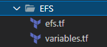

# Documentation of Project 18

1. I created a modules folder so as to make my workspace more neater and easy to access

2. In the modules folder, I created 7 folders namely;

a. ALB:- for creating loadbalancers and target groups

b. Autoscaling:- for creating autoscaling groups

c. Compute:- for creatinh jenkins,sonarqube and artifactory server

d. EFS:-for creating elastic file system and access points

e. RDS:- for creating database

f. Security:- for creating security groups and their respective inbound rules

g. VPC:- for creating VPC, public and private subnets
       
       
       
       
       
       
       
       
       

3. I created a some files in my workspace namely;
a. main.tf
b. providers.tf
c. variables.tf

     
     
     

4. I ran a terraform plan and it worked without issues
     
     
     
     
     
     
     
     
     
     
     
     
     
     
     
     
     
     
     
     
     
     
     

4. I ran `terraform apply` command and it worked successfully
     
     
     

5. I confirmed everything that has been created in my aws console
     
     
     
     
     
     
     
     
     
     
     
     
     
     
     
     

6.   I created a new file in my workspace named "backend.tf" to use my S3 bucket as a backend
      
      

7.  I initialized terraform to make effects to my changes
     
     

8. I checked my aws console to confirm what I did
    
    
    
    

9. I destroyed my infrastructure so as to avoid unneccessary debts but I commented out the commands in my 'backend.tf' file so as not to delete terraform.tfstate file
       
        